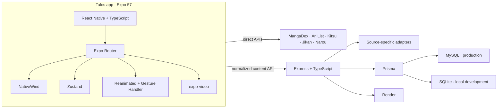
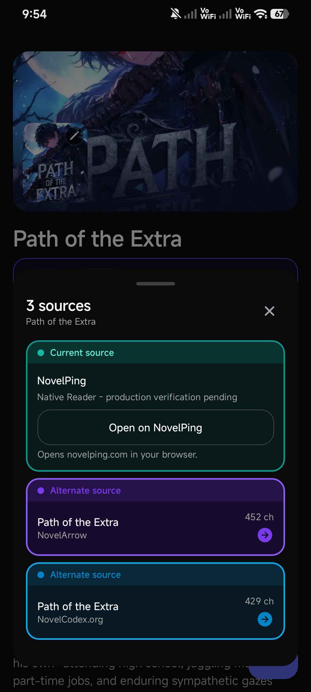
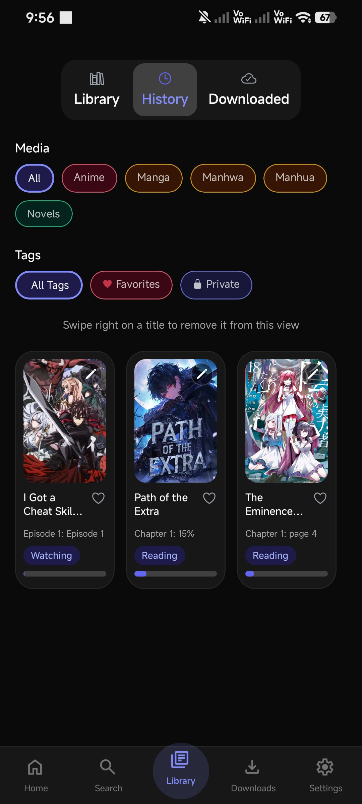
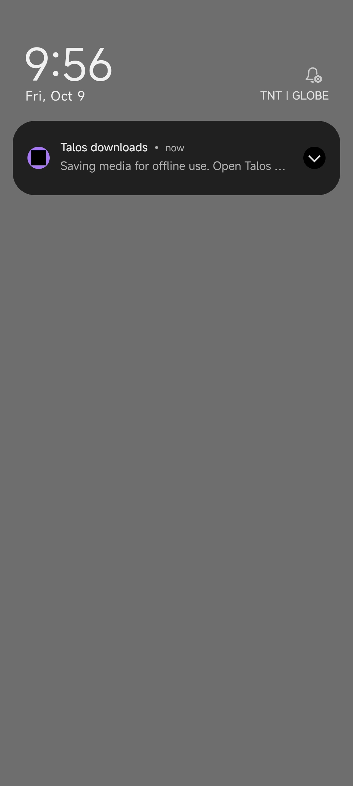
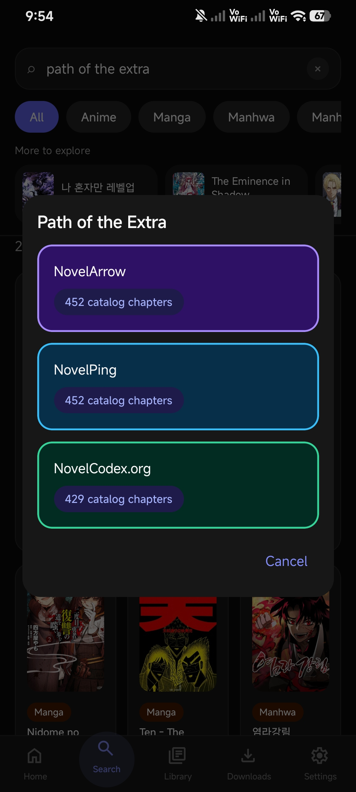

<h1> Talos: Unified Media Reader & Streaming Platform</h1>

One library for manga, manhwa, manhua, novels, and anime ? built for Android and the web.


---

## Overview

Talos brings provider discovery, reading, playback, and a persistent local library into one app. A typed provider registry connects public APIs and an Express content gateway to shared reader and player models. Downloads retain supported content and metadata for offline use.

This is an actively developed beta. Provider availability, subtitle coverage, and downloadable media vary by source; transport checks do not replace physical-device testing.

## Features

- **Unified search & discovery** across manga, novels, and anime providers
- **Manga / manhwa / manhua reader** with pinch zoom, double-tap zoom, fling, RTL/LTR, and bookmarks
- **Novel reader** with continuous and chapter modes, styling controls, and bookmarks
- **Anime playback** with subtitles, bookmarks, offline downloads where supported
- **Library, history, and progress** persistence
- **Downloads / offline** queue for supported media types
- **Rolling chapter downloads** with configurable 5, 10, 15, or 20 chapter windows
- **Custom title covers** from the photo library or a selected manga page
- **Multi-provider architecture** with source switching and failure isolation
- **In-app update checker** against the official GitHub Releases channel

## Tech Stack

- **App:** Expo 57, React Native, TypeScript, Expo Router, NativeWind, Zustand.
- **Readers and player:** Reanimated, Gesture Handler, expo-video.
- **Backend:** Node.js, Express, Cheerio, Prisma; MySQL in production and SQLite for local development.
- **Delivery:** Render, EAS Build / Hosting, GitHub Releases.

## Architecture



## Screenshots

<p align="center">
  
  
  
  
</p>
<p align="center">
  
  
  
  
</p>
<p align="center">
  
  
  
  
</p>
<p align="center">
  
  
</p>

## Demo

<p align="center"></p>

Full demo video: [latest GitHub Release](https://github.com/Hitorido/talos-media-platform/releases/latest).

## Installation

```bash
git clone https://github.com/Hitorido/talos-media-platform.git
cd talos-media-platform
npm install
npm --prefix backend install
```

Follow [Development](docs/DEVELOPMENT.md) for backend environment and database setup. Set the public backend URL in the root `.env.local`:

```dotenv
EXPO_PUBLIC_API_URL=https://talos-media-platform.onrender.com
```

For a local backend on a physical phone, replace that URL with your computer's LAN address, such as `http://192.168.1.10:5000`. `localhost` on a phone refers to the phone itself. Never put secrets in `EXPO_PUBLIC_` variables.

```bash
# Backend terminal
npm --prefix backend run dev

# App terminal
npx expo start
```

```bash
npm run typecheck
npm run lint
npm --prefix backend run build
```

## Web Version

[Open the web beta](https://talos-media-platform--go1st4khak.expo.app). Browser media support and cross-origin restrictions can differ from Android.

## Android Beta

Download the APK from [GitHub Releases](https://github.com/Hitorido/talos-media-platform/releases). Optional in-app update notices link to the same release channel.

To build an installable preview, including native launcher-icon changes:

```bash
eas build --platform android --profile preview
```

## Provider Notes

Talos uses fixed, source-specific adapters rather than an arbitrary-URL scraping endpoint. Sources can change catalogs, restrict chapters, or become unavailable. Public catalog totals do not necessarily equal readable or downloadable totals.

The Render service may sleep when idle; backend requests share a health-check wake-up flow. New backend adapters require deployment before they work through the hosted service. Source challenges and locked chapters are reported without bypasses.

See [Phase 6.5 development evidence](PHASE-6.5-PROVIDER-EXPANSION.md) and the [provider matrix](PHASE-6.5-PROVIDER-MATRIX.md) for dated tests and limitations.

## Roadmap

- Verify reader gestures, bookmarks, and playback on physical Android devices.
- Expand sources with tested full chapter and episode flows.
- Improve subtitle coverage and offline anime packaging.
- Strengthen source failure recovery and discovery coverage.

## License

See [LICENSE](LICENSE) for the repository's MIT license text and retained notices. Third-party content and dependencies retain their respective rights and licenses.
