# Talos

<p align="center">
  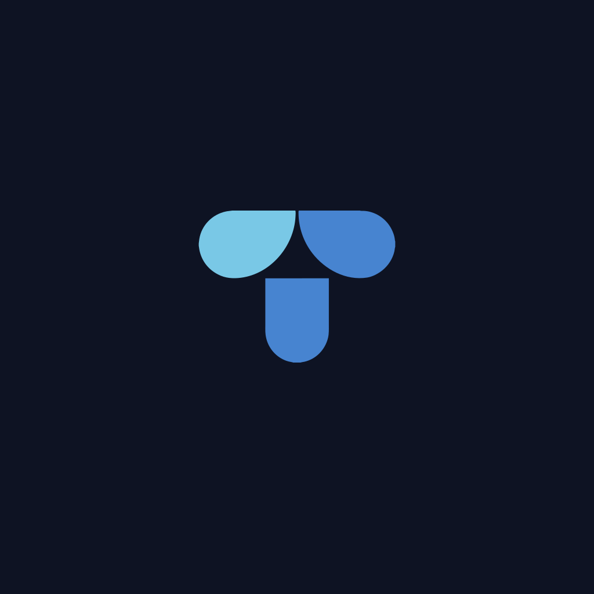
</p>

<p align="center">
  <strong>Talos</strong> is a unified media application for discovering, reading, watching, organizing, and downloading supported manga, novels, and anime across multiple provider integrations.
</p>

<p align="center">
  
  
  
  
</p>

## Preview

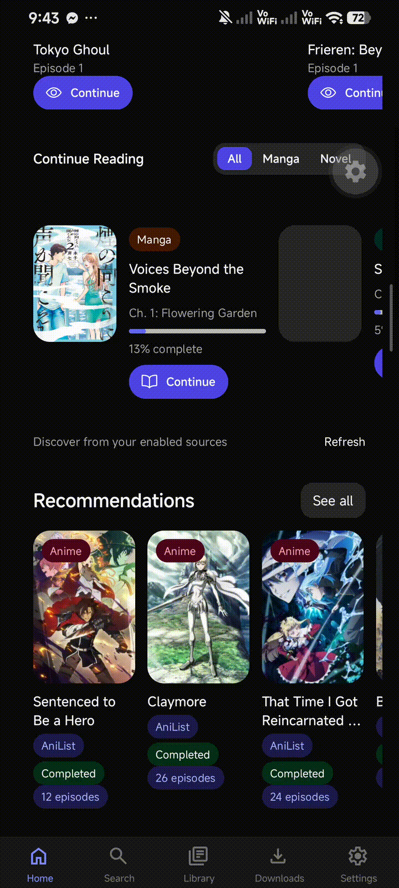

Full demo video is available in the [latest GitHub Release](https://github.com/Hitorido/talos-media-platform/releases/latest).

## Screenshots

<p align="center">
  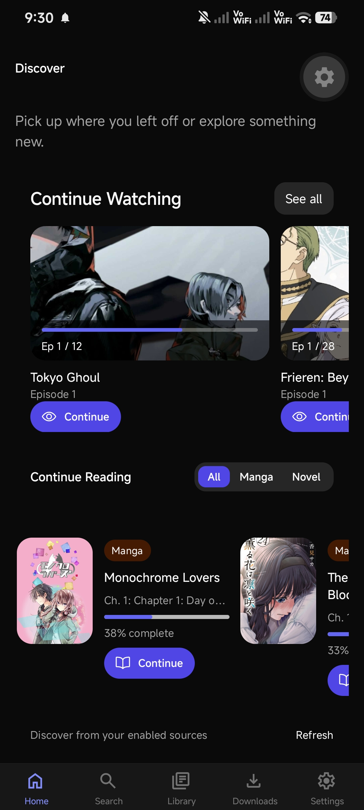
  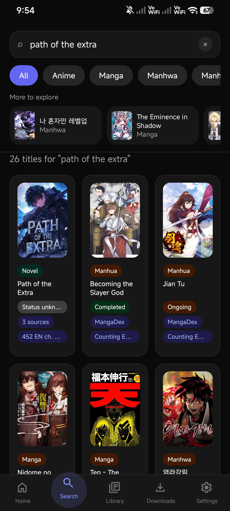
  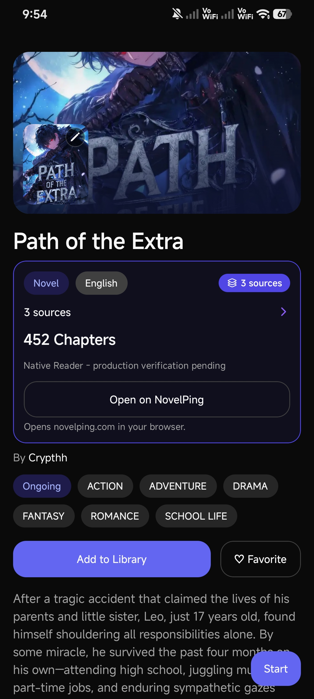
  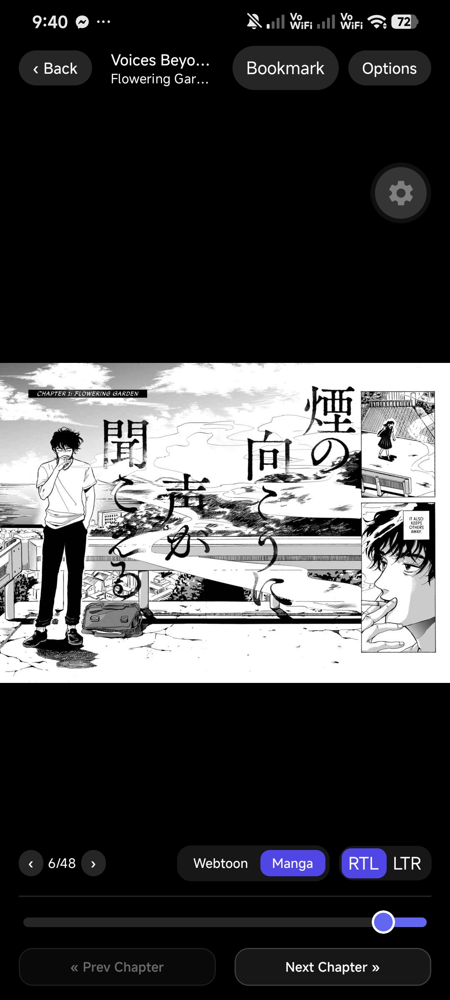
</p>
<p align="center">
  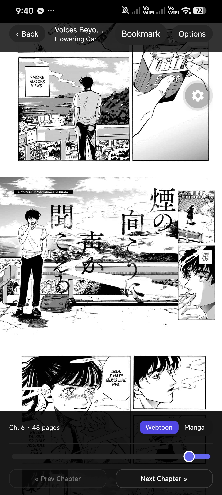
  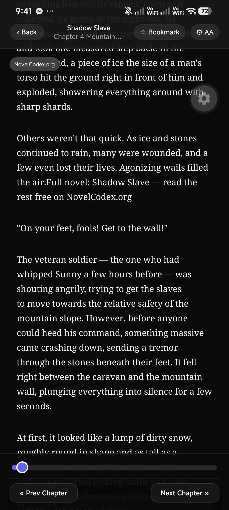
  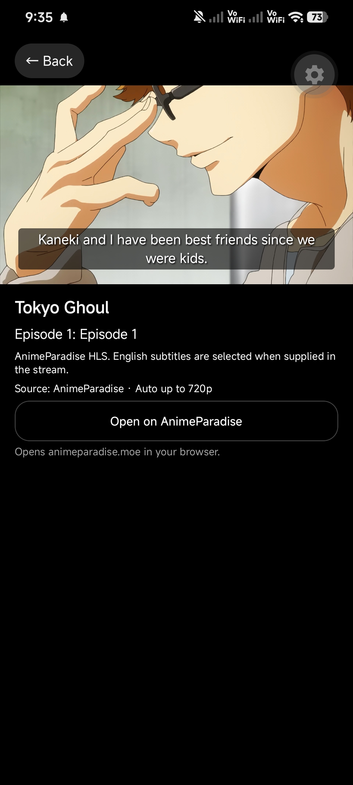
  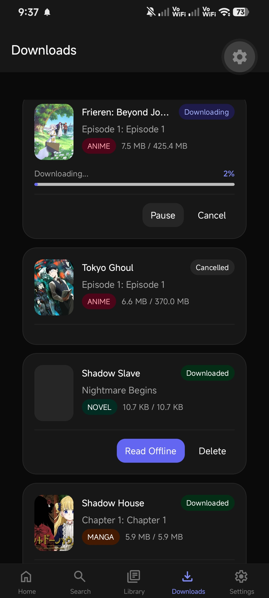
</p>
<p align="center">
  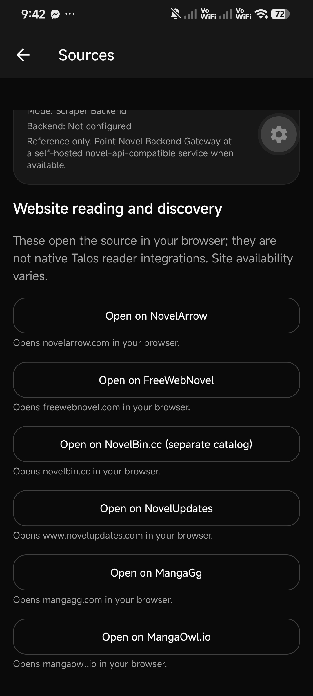
  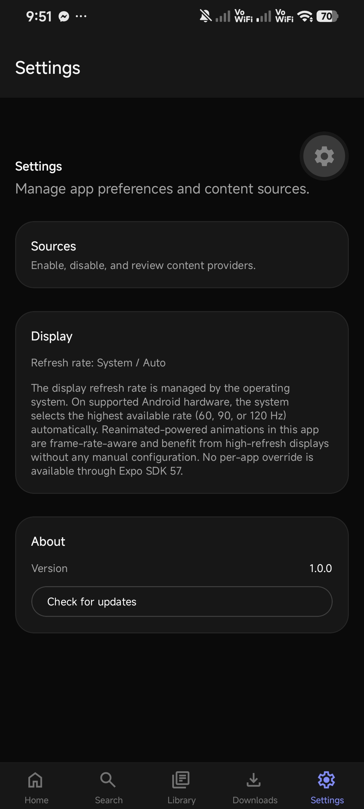
</p>

## Features

- **Unified search & discovery** across manga, novels, and anime providers
- **Manga / manhwa / manhua reader** with pinch zoom, double-tap zoom, fling, RTL/LTR, and bookmarks
- **Novel reader** with continuous and chapter modes, styling controls, and bookmarks
- **Anime playback** with subtitles, bookmarks, offline downloads where supported
- **Library, history, and progress** persistence
- **Downloads / offline** queue for supported media types
- **Rolling chapter downloads** with configurable 5, 10, 15, or 20 chapter windows
- **Custom title covers** from the photo library or a selected manga page
- **Multi-provider architecture** with source switching and failure isolation
- **In-app update checker** against the official GitHub Releases channel

## Technology

**Frontend:** Expo 57, React Native, TypeScript, Expo Router, NativeWind, Zustand, Reanimated, Gesture Handler, expo-video

**Backend:** Node.js, Express, TypeScript, Prisma, MySQL (production), SQLite (local development)

**Infrastructure:** Render, Aiven MySQL, EAS Hosting / EAS Build, GitHub Releases

<p align="center">
  
  
  
  
  
  
</p>
<p align="center">
  
  
  
  
  
  
</p>

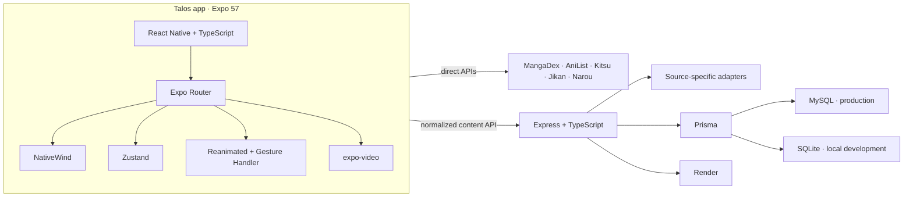

## Architecture

```
Talos (Android / Web)
  ├─ Direct APIs (MangaDex, AniList, Kitsu, Jikan, …)
  └─ Talos Render Backend
       └─ Fixed source-specific adapters
            └─ Normalized Talos media models
```

Talos does not expose a generic arbitrary-URL scraper. Scraper Backend providers use dedicated adapters on the Render service.

## Installation (developers)

```bash
git clone https://github.com/Hitorido/talos-media-platform.git
cd talos-media-platform
npm install
cd backend && npm install && cd ..
```

Public client env (optional for local development):

```bash
# .env.local — never commit secrets
EXPO_PUBLIC_API_URL=http://localhost:5000
```

Production / beta builds default to `https://talos-media-platform.onrender.com`.

```bash
# Terminal A — backend
cd backend && npm run dev

# Terminal B — Expo
npx expo start
```

## Beta download

Install the Android APK from [GitHub Releases](https://github.com/Hitorido/talos-media-platform/releases).

Updates are optional. Talos can notify you in-app when a newer beta is published; Download opens the official release page only.

## Web version

Talos is available on the web through EAS Hosting:

https://talos-media-platform--go1st4khak.expo.app

## Update manifest

Clients check:

`GET https://talos-media-platform.onrender.com/api/version`

Hosted on the Talos backend. The `downloadUrl` must point at the official GitHub Releases page.

## Provider disclaimer

Providers are third-party sites and APIs. Availability can change without notice. Talos does not control upstream uptime, CAPTCHA, geo blocks, or anti-bot measures. Some sources may appear limited or unavailable in beta.

## Roadmap

- Stabilize scraper backends behind Render
- Expand reliable discovery feeds
- Improve offline packaging for anime media
- Optional account sync polish

## Development status

**Beta** — suitable for early testers. Not a stable 1.0 release.

## License

See repository license terms and third-party attributions where applicable.
